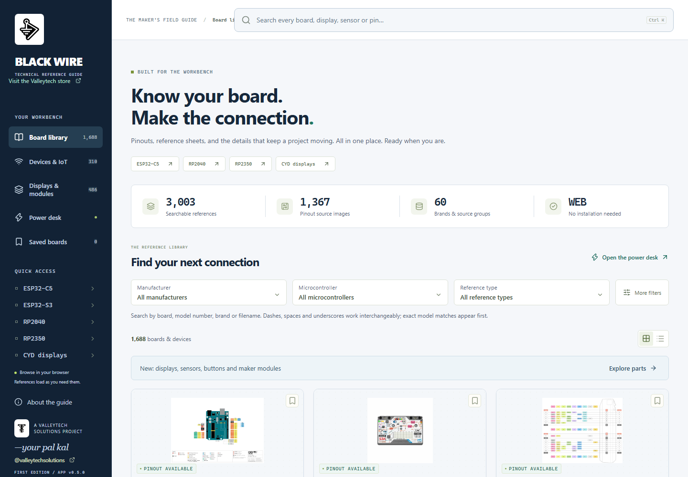
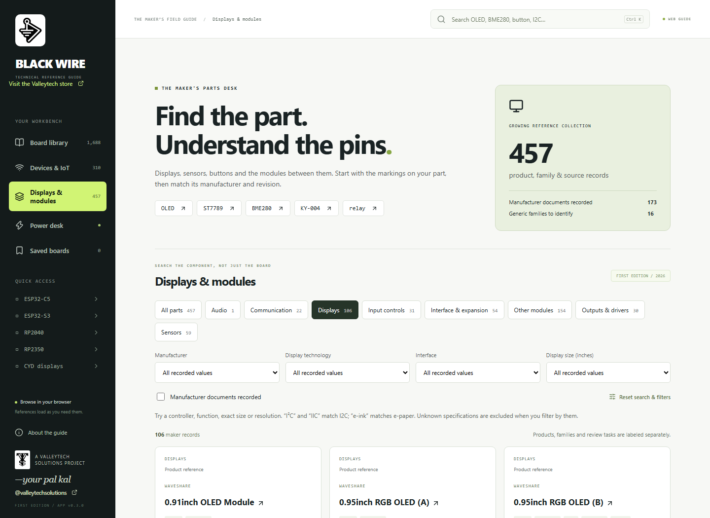
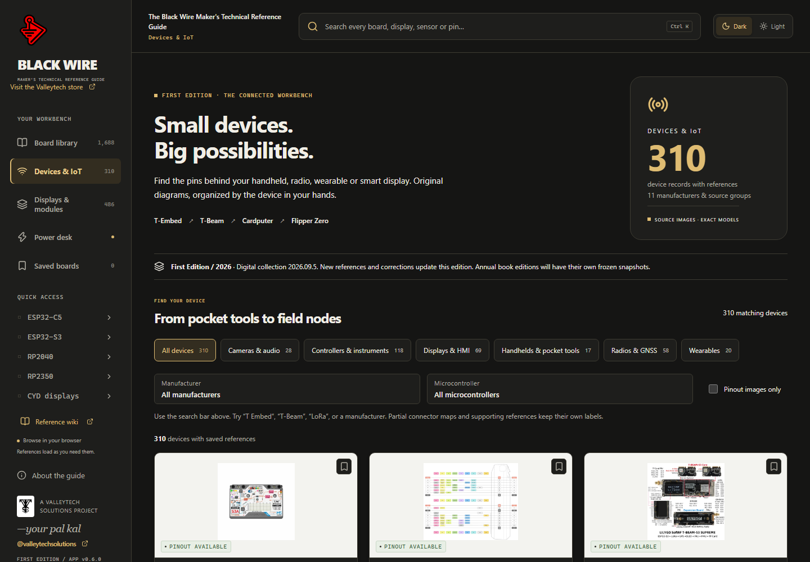
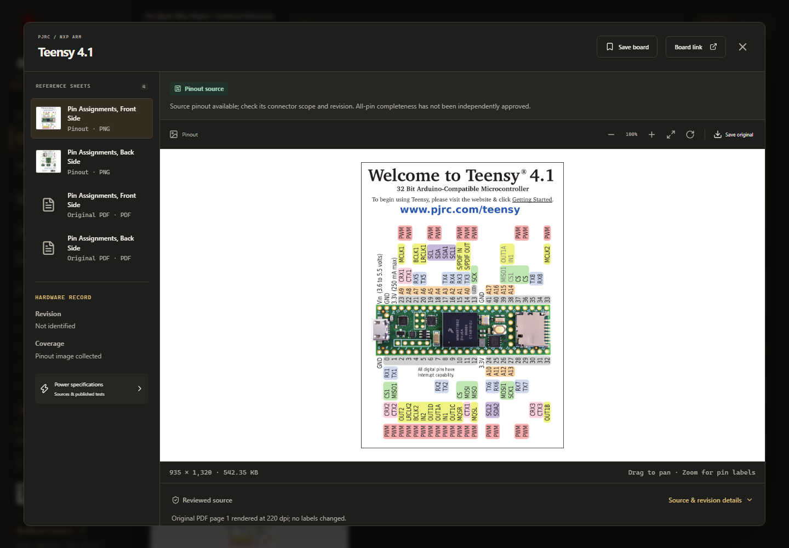
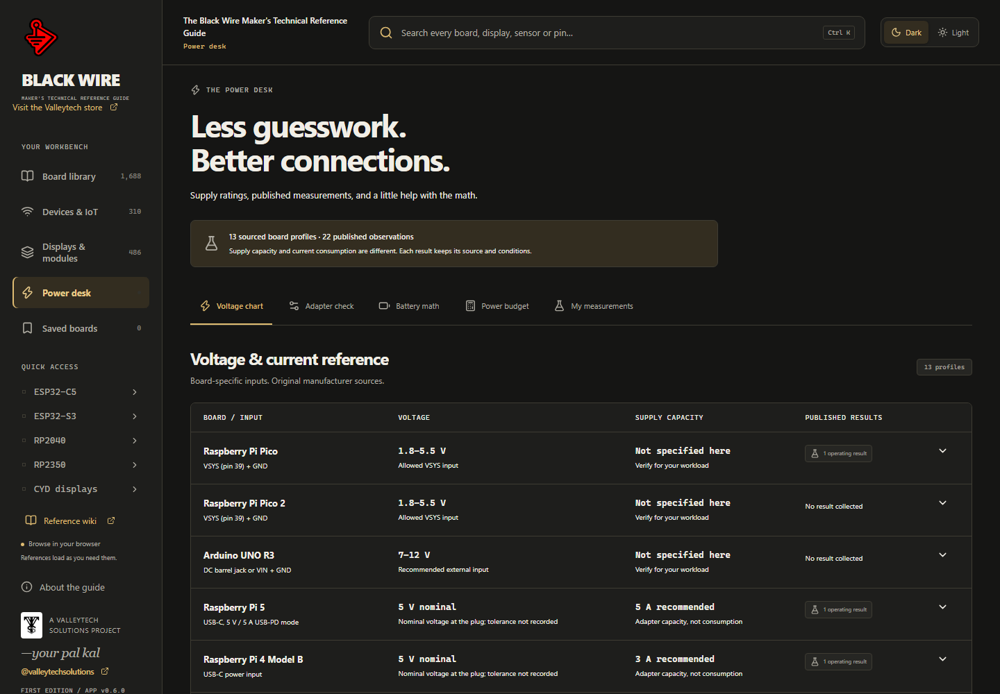
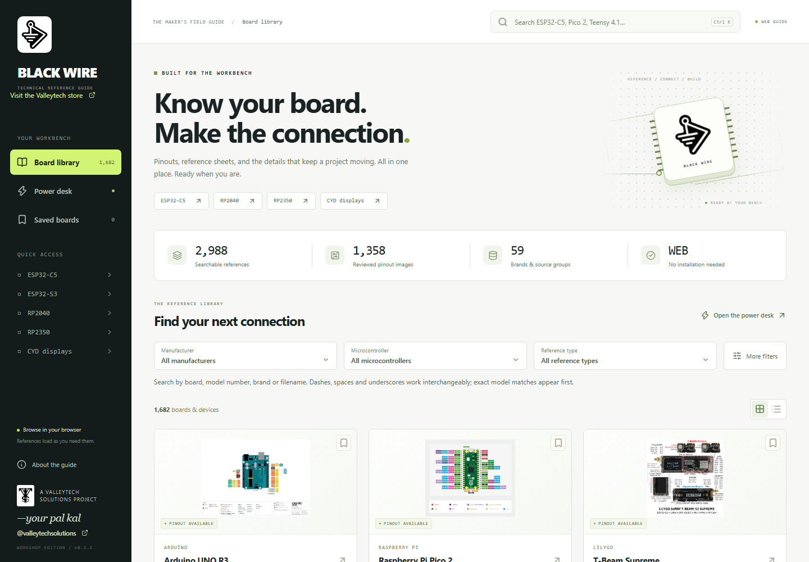

   &nbsp;&nbsp;
  

<h1 align="center">Black Wire Technical Reference Guide</h1>

<strong>Know your board. Make the connection.</strong> A Valleytech Solutions project, made for the workbench.

Makers · Educators · Students · Hobbyists · Engineers

<a href="https://github.com/valleytechsolutions/black-wire-desktop/releases">Downloads & release status</a> · <a href="https://github.com/valleytechsolutions/black-wire-pinouts">Browse the pinout collection</a> · <a href="docs/BUILDING.md">Build the app</a> · <a href="CONTRIBUTING.md">Contribute</a>

  

## New in 0.3.0 / maker parts desk

Find displays, sensors, buttons and modules alongside the board library. The new intake contains 457 records, with 173 manufacturer documentation records, linked existing references and explicit generic identification tasks. Filter by function, interface, display technology, size or manufacturer; search controller codes and resolutions. Each record shows its evidence and missing review work. These records are not 457 complete pinout sheets.

[Open Displays & modules](https://valleytech-black-wire-guide.pages.dev/?tab=makers) · [Coverage roadmap](https://github.com/valleytechsolutions/black-wire-pinouts/blob/main/docs/MAKER_ROADMAP.md)

## Your board. Its pins. One place.

Black Wire is an offline desktop workbench for the moment you need to know **what that pin does**. Find the exact board, open its original pinout, check its revision and source, and keep the references you use most within reach.

Built for a student's first breadboard, an educator's lab, a hobbyist's parts drawer and an engineer's prototype bench.

| At your bench | What the app does |
|---|---|
| Find the right board | Search names, aliases and filenames; filter manufacturer, MCU variant, family and review status. Dashes, spaces and underscores work interchangeably. |
| Find a maker device | Dedicated Devices & IoT tab with 310 device records, category filters, exact model references and visible documentation gaps. |
| Read the details | Zoom, pan and rotate diagrams; browse local PDFs; save the original-resolution file. |
| Check the source | Keep source links, revision notes, coverage labels and hashes with each reference. |
| Plan power | Read sourced voltage/current profiles and published observations; compare adapter ratings, estimate battery runtime and total power across voltage rails. |
| Keep your work | Save boards and your own measurements locally; import/export JSON backups. |
| Stay offline | No account, analytics or cloud sync. External source and YouTube links open only when selected. |

### A growing library

**3,003 reference entries · 1,365 reviewed physical pinout images · 60 brands/source groups.** There are 1,688 populated catalog records, including shared references and unreviewed source products. This is a collection snapshot, not a claim to cover every board ever made.

ESP32 variants including C5/C6/S3, RP2040/RP2350, CYD displays, Arduino, Teensy, Raspberry Pi, other SBCs, radio boards and GPIO devices are indexed separately where their identities are known. Chip-package references are labeled separately from board pinouts.

## Devices & IoT

Browse handhelds, radios, wearables, displays, cameras and controllers. Search T-Embed, T-Beam, Cardputer or Flipper Zero using the same dash-tolerant search. In-development documentation is labeled; missing pinout images stay in a documentation-watch list.

The guide is **First Edition / 2026**, with digital collection snapshot **2026.09.2**. App updates and collection snapshots do not advance the annual book edition. See [publication workflow](docs/MAINTENANCE.md).

## Look closer

Original images stay intact. Partial maps and unknown revisions remain visible so users can compare the reference with the board on their bench.

The power desk includes **13 sourced profiles and 22 published operating observations**. Manufacturer requirements, nominal values, published measurements and personal bench readings are distinct. Unknown values stay unknown. Published observations were not measured by Black Wire; a typical current reading is not a guaranteed maximum or a supply recommendation.

## Download and open

Check [Releases](https://github.com/valleytechsolutions/black-wire-desktop/releases) for the actual available assets and validation status. An absent platform asset means that platform has not been released.

**Available now: [Windows x64 preview 0.2.0](https://github.com/valleytechsolutions/black-wire-desktop/releases/tag/v0.2.0).** Linux and macOS build targets are provided, but verified downloads for those systems have not been published. For images and PDFs without an application, use the separate [pinout collection releases](https://github.com/valleytechsolutions/black-wire-pinouts/releases); those ZIP files can be read on all three operating systems.

| Platform | Current status |
|---|---|
| Windows x64 | 0.2.0 renderer tested in the browser; installer and bundled library verified. Native installation of this version on a clean Windows machine still needs validation. Workshop builds are unsigned unless the release explicitly says otherwise. |
| Linux x64 / ARM64 | Packaging supported; native launch validation remains outstanding. |
| macOS Intel / Apple Silicon | Build targets provided; a Mac, Developer ID signing and notarization are needed for a distributable release. No verified Mac binary is claimed. |

For Windows, download the complete installer from a release, then open it from File Explorer. It creates desktop and Start menu shortcuts and keeps the reference library with the app. Portable ZIP users must extract **all** files before opening the application. Do not move a lone EXE out of its folder.

Read [DOWNLOADS.md](docs/DOWNLOADS.md) for checksums, signing status and security warnings. A checksum checks download integrity; it does not replace a trusted publisher signature. Preview builds may still trigger Windows warnings.

## Browser edition for the Valleytech store

**[Open BWM-Technical Reference Guide on the Valleytech store](https://valleytechsolutions.tech/pages/bwm-technical-reference-guide)** — or [open the guide full screen](https://valleytech-black-wire-guide.pages.dev/).

The complete current catalog is available in your browser. Search, view pinouts/PDFs and use power tools without installing an app. References load on demand; browser bookmarks and measurements stay local. The live Shopify embed has been checked on desktop and phone widths. The desktop edition remains available for offline use.

See [Website integration](docs/WEBSITE.md) for the prepared page, build commands and hosting requirements.

## Two repositories, one field guide

- **[black-wire-pinouts](https://github.com/valleytechsolutions/black-wire-pinouts):** images, PDFs, catalog, board pages and per-reference attribution.
- **This repository:** desktop application, power data, UI screenshots, tests and packaging. Large library files are imported during a build; personal bookmarks and measurements are never part of the repository.

See [Build and development](docs/BUILDING.md), [Workbench guide](docs/WORKBENCH.md), [Attribution](ATTRIBUTION.md) and [Contribution guide](CONTRIBUTING.md).

## Attribution and project status

Original board artwork belongs to its credited authors/manufacturers. This application does not claim ownership or grant new permissions over those references. See the collection's [per-asset ledger](https://github.com/valleytechsolutions/black-wire-pinouts/blob/main/catalog/attributions.csv) before reuse. **Original app code: [MIT](LICENSE)** — reuse and modify, including commercially, while retaining the copyright and permission notice. **Original guide material: CC BY 4.0** — reuse with attribution, a license link and a note of changes. See [license scope](LICENSING.md), [creator credit](NOTICE.md) and [privacy](PRIVACY.md). These licenses do not relicense manufacturer diagrams.

First Edition is a growing digital collection for a lasting maker reference. A wiki and annual print editions are future projects, with separate completeness, rights and print-quality reviews.

---
Created and curated by **—your pal kal** · [@valleytechsolutions on YouTube](https://www.youtube.com/@valleytechsolutions)

Black Wire and Valleytech logos belong to their creator. Manufacturer names and trademarks identify the referenced hardware; they do not imply endorsement.
